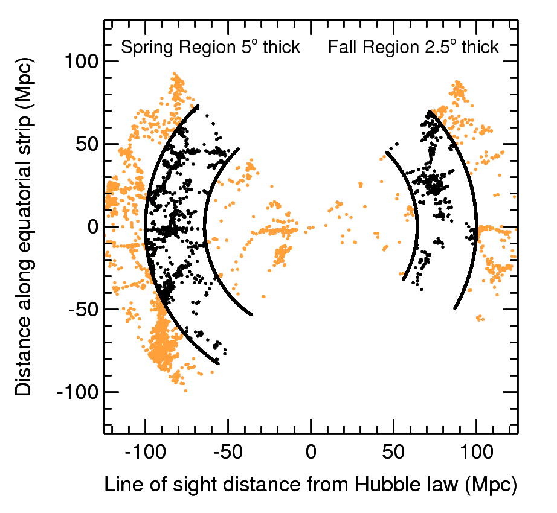
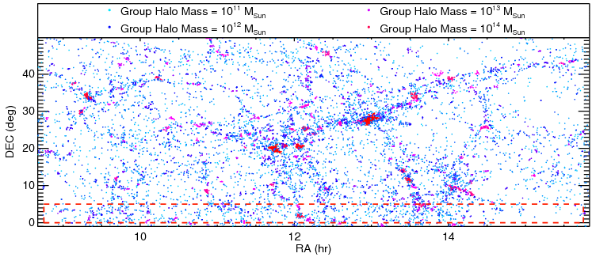
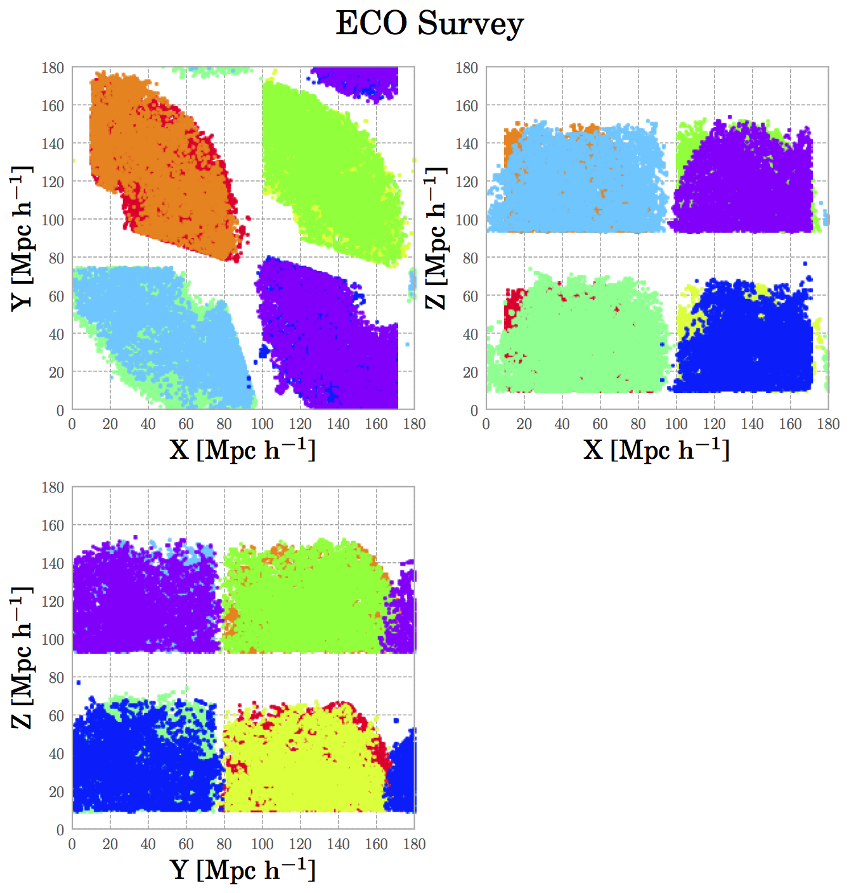

.. ECO_Resolve_Catalogues

.. _Mock_Catalogues:
===================
Mock Catalogues
===================

This is a brief overview of the different aspects of the synthetic 
catalogues produced for ECO RESOLVE-A and RESOLVE-B surveys

.. contents:: Table of Contents
    :local:

.. _eco_resolve_main_data:
--------------------------
ECO and RESOLVE
--------------------------

We construct a set of synthethic (mock) catalogues that have the same 
geometries as the **Environmental COntext** (ECO), **RESOLVE-A**, and 
**RESOLVE-B** galaxy surveys.

REsolved Spectroscopy Of a Local VolumE (RESOLVE) is a volume-limited 
census of stellar, gas, and dynamical mass as 
well as star formation and merging within >50,000 cubic Mpc of the nearby 
cosmic web, reaching down to the dwarf galaxy regime and up to structures 
on tens of Mpc scales such as filaments, walls, and voids.

The Environmental COntext (ECO) catalog around RESOLVE is a much larger, 
purely archival data set with pipelines and methods matched to RESOLVE, 
enabling statistically robust analyses of environmental trends and 
calibration of cosmic variance.

**This shows the right-ascension (RA) and declination (DEC) of 
galaxies in RESOLVE-A and RESOLVE-B galaxy redshift surveys.**

**RESOLVE-A (footprint demarcated by red dashed lines) embedded within ECO 
(entire plot showing current footprint, with ECO-B in preparation)**

For more information on how the data for the different galaxy surveys 
were taken, go to the `Main ECO and RESOLVE <https://resolve.astro.unc.edu/>`_
website.

.. _mock_construction:
--------------------------
Constructing catalogues
--------------------------

We design the *synthetic* catalogues to have the exact same 
geometries and redshift limits as those of the ECO, RESOLVE-A, and 
RESOLVE-B galaxy surveys.

This is a summary of the values used to create the synthetic galaxy catalogues.
These catalogues are taking a *buffer* regions, which is an *extra* buffer 
region along the `cz` (velocity) direction in redshift-space.

+----------+-----------------+----------+-------------+-----------+--------+---------+-------------+------------+-------------+
| Survey   | RA (deg)        | RA range | DEC (deg)   | DEC range | zmin   | zmax    | Vmin (km/s) | Vmax (km/s)| Dist (Mpc)  |
+==========+=================+==========+=============+===========+========+=========+=============+============+=============+
| A        | (131.25, 236.25)| 105.0    |(0  ,+5)     | 5         | 0.00844| 0.0249  | 2532        |  7470.     |(25.32,70.02)|
+----------+-----------------+----------+-------------+-----------+--------+---------+-------------+------------+-------------+
| B        | (330.0 , 45.0  )| 75.0     |(-1.25,+1.25)| 2.5       | 0.01416| 0.024166| 4250        |  7250.     |(42.5 , 72.5)|
+----------+-----------------+----------+-------------+-----------+--------+---------+-------------+------------+-------------+
| ECO      | (130.05, 237.45)| 107.4    |(-1, +49.85) | 50.85     | 0.00844| 0.0249  | 2532        | 7470.      |(25.32,70.02)|
+----------+-----------------+----------+-------------+-----------+--------+---------+-------------+------------+-------------+

The next table provides the number of synthetic catalogues per cubic box of **L = 180 Mpc/h**, where *h* = 1.

+--------+--------------+
| Survey | Number Mocks |
+========+==============+
| A      | 59           |
+--------+--------------+
| B      | 104          |
+--------+--------------+
| ECO    | 8            |
+--------+--------------+

.. _mock_distribution_box:
-----------------------------------------------
Distribution of catalogues in simulation box
-----------------------------------------------

In order to maximize the number of catalogues per simulation, we 
have to fit as many catalogues as we can, while keeping a 
distance of ~10 Mpc/h between catalogues. We chose this distance of 
10 Mpc/h in order to avoid using the same galaxy for different 
catalogues, and also to make the catalogues as independent from each 
other as possible.

This figure shows how the catalogues for ECO surveys are organized 
within the simulation box used for this analysis.

.. download_read_catalogues::
------------------------------------------------
Downloading and reading in data from catalogues
------------------------------------------------

The mock catalogues are located at 
`<http://lss.phy.vanderbilt.edu/groups/data_eco_vc/Mock_Catalogues/>`_.

These catalogues can be downloaded as *tar* files, and be read by 
the Python package `Pandas <https://pandas.pydata.org/>`_.

After having downloaded your file, you can read them in the following way:

.. literalinclude:: ../example_scripts/read_ECO_RESOLVE_catls.py

.. properties_description::
------------------------------------------------
Description of the *fields* in the catalogues
------------------------------------------------

Each mock catalogues contains information about the **galaxy**, 
**group galaxy**, **host halo**, and more. We will denote 
\*dark matter* as *DM*.

.. properties_description_main_catl::
^^^^^^^^^^^^^^^^^^^^^^^^^^^^^^
*Main* Galaxy Properties
^^^^^^^^^^^^^^^^^^^^^^^^^^^^^^

.. list-table:: List of Parameters
    :widths: 25 60 15
    :header-rows: 1

    * - Field
      - Description
      - Units
    * - :code:`ra`
      - Right Ascension
      - degrees
    * - :code:`dec`
      - Declination
      - degrees
    * - :code:`cz`
      - Velocity of the galaxy (**with redshift-space distortions)
      - km/s
    * - :code:`M_r`
      - r-band absolute magnitude of the galaxy
      - magnitudes
    * - :code:`haloid`
      - Dark matter halo ID, as taking from the simulation
      - None
    * - :code:`loghalom`
      - logarithmic value of the DM's mass
      - log(Msun/h) where h=1
    * - :code:`halo_ngal`
      - Total number of galaxies in DM halo. Number of galaxies in the mock may differ from this value
      - None
    * - :code:`cs_flag`
      - Type of galaxy. **Halo central** = 1, **Halo satellite** = 0
      - None
    * - :code:`cz_nodist`
      - Velocity of the galaxy (*without* redshift-space distortions)
      - km/s
    * - :code:`dist_c`
      - *Real* distance between halo's central galaxy and the galaxy.
      - Mpc/h with h=1
    * - :code:`vel_tot`
      - Total velu for **peculiar** velocity
      - km/s
    * - :code:`vel_tan`
      - Tangential component of the peculiar velocity
      - km/s
    * - :code:`morph`
      - Galaxy's morphology. 'LT': *Late Type*; 'ET': *Early type*. Used either *goodmorph* (ECO) or *MORPH* (RESOLVE) keys. '-9999' if no matched galaxy
      - None
    * - :code:`logmstar`
      - Log value of galaxy's stellar mass. Used either '*rpgoodmstarsnew*' (ECO) or '*MSTARS*' (RESOLVE) keys in the files
      - log(Msun)
    * - :code:`rmag`
      - r-band *apparent* magnitude. Used either 'rpsmoothrestrmagnew' (ECO) or '*SMOOTHRESTRMAG*' (RESOLVE) keys in the files.
      - magnitudes
    * - :code:`umag`
      - u-band *apparent* magnitude. Used either 'rpsmoothrestumagnew' (ECO) or '*SMOOTHRESTUMAG*' (RESOLVE) keys in the files.
      - magnitudes
    * - :code:`fsmgr`
      - Stellar mass produced over last Gyr divided by pre-existing stellar mass from new model set. Used '*rpmeanssfr*' (ECO) or '*MODELFSMGR*' (RESOLVE) keys.
      - (1/Gyr)
    * - :code:`survey_flag`
      - Survey name, from which the properties of the **real** matched galaxy were extracted.
      - None
    * - :code:`u_r`
      - Color of the matched galaxy, i.e. (:code:`umag` - :code:`rmag`)
      - magnitudes
    * - :code:`mhi`
      - HI mass in galaxy. Used the *predicted* HI massed (matched to the ECO file, i.e. :code:`eco_wresa_050815.dat`) and the key '*MHI*' (RESOLVE). To compute MHI masses using *ECO*, we used the formula: 10^(:code:`MHI` + :code:`logmstar`)
      - Msun
    * - :code:`groupid`
      - Group ID, to which the galaxy belongs after running *Berlind2006* FoF group finder.
      - None
    * - :code:`g_ngal`
      - Number of galaxies in a group of galaxies
      - None
    * - :code:`halo_rvir`
      - Virial radius of the DM halo, to which the galaxy belongs.
      - Mpc/h with *h* = 1.
    * - :code:`M_group`
      - Abundance matched mass of the galaxy group. This was calculated by assuming a monotonic relation between DM halo mass :code:`logM_halo` and the group *total* luminosity. For RESOLVE-B, we used a modified version of the *ECO* group luminosity function.
      - Msun/h with *h* = 1
    * - :code:`g_galtype`
      - Type of galaxy. **Group central** = 1, **Group satellite** = 0
      - None        

.. note::

    The relationship between velocities (:code:`cz`'s') is the following:
    (:code:`cz` - :code:`cz_nodist`)^2 + (:code:`vel_tan`)^2 = (:code:`vel_tot`)^2.

.. properties_description_main_catl::
^^^^^^^^^^^^^^^^^^^^^^^^^^^^^^
Halos Filaments
^^^^^^^^^^^^^^^^^^^^^^^^^^^^^^

**Author**: Roberto Gonzales [`regonzar@astro.puc.cl <mailto:regonzar@astro.puc.cl>`_ or `regonzar@oddjob.uchicago.edu <mailto:regonzar@oddjob.uchicago.edu>`_]

**Affiliation**: The University of Chicago, Universidad Católica de Chile

.. list-table:: List of Parameters - Halo Filaments
    :widths: 15 40 15
    :header-rows: 1

    * - Field
      - Description
      - Units
    * - :code:`Halo ID`
      - Halo ID number for the given DM halo in the simulation box.
      - 
    * - :code:`log(MHalo)`
      - Logarithmic value of the DM halo's mass, as :math:`log(MHalo)`
      - log(Msun/h) with *h* = 1
    * - :code:`ID/Type`
      - ID of the DM halo's environment. '0': Not in a filament; '1': filament node; '2': part of a filament skeleton; '3': within a clode radius of a filament.
      - 
    * - :code:`Fil`
      - ID of the halo's filament. (-1 if not in a filament)
      - 
    * - :code:`Fil. Quality`
      - Quality of the filament, i.e. probability that the filament is *real*
      - 

